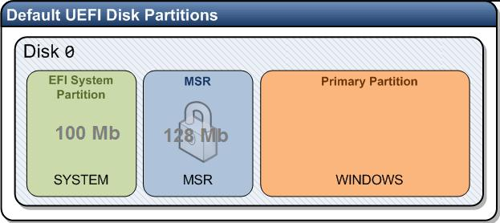

# WINDOWS

## CMD commands

### ENVIRONMENTS(переменные окружения)

#### SETX

Команда **SETX** изменяет на постоянной основе переменную окружения

```dos
setx PATH "some/path/;%PATH%"
```

### Поиск(Search)

#### Поиск текста в файле(включая подкаталоги) без учета заглавных букв

```dos
findstr /s /m /i text_tosearch *.txt
```

## ВРЕМЯ(TIME)

### Проверка доступности NTP сервера

```dos
w32tm /stripchart /computer:10.15.101.1 /dataonly /samples:5
```

## Восстановление удаленного загрузочного EFI раздела в Windows



+ System - EFI System Partition 100Mb-1Gb(не более 1% от размера диска) SYSTEM(FAT32). Системный раздел EFI.
+ MSR - Microsoft Reserved(NTFS).

Раздел **ESP**, EFI System Partition, с файловой системой FAT32, является обязательным для дисков с gpt.

1. Загрузимся с установочного носителя Windows
2. На экраане начала устаноывки нажмем **Shift+F10**, для открыия оболочки командной строки
3. Запустим команду утилиту для работы с жесткими дисками:

    ```dos
    diskpart
    ```

4. Выведем список дисков

    ```dos
    list disk
    ```

5. Выберем нужный диск(в примере нулевой)

    ```dos
    select disk 0
    ```

6. Выведем разделы на диске

    ```dos
    list partition
    ```

7. Выберем требуемый раздел и удалим его

    ```dos
    select partition 1
    delete partition override
    list partition
    list vol
    ```

8. Создание EFI раздела

    ```dos
    select disk 0
    create partition efi size=100
    list partition
    select partition 1
    format quick fs=fat32 label="System"
    assign letter=G
    ```

9. Создадим MSR раздел 128 Мб(на Windows 10/11 16Мб)

    ```dos
    create partition msr size=128
    list partition
    list vol
    select vol 1
    assign letter=C
    ```

10. Выходим из утилиты работы с жесткими дисками

    ```dos
    exit
    ```

11. Восстановим файл данных конфигурации загрузкм **BCD**

    ```dos
    bcdboot C:\Windows /s G:
    ```

12. Перезапишем BCD

    ```dos
    bootrev /rebuild
    ```
